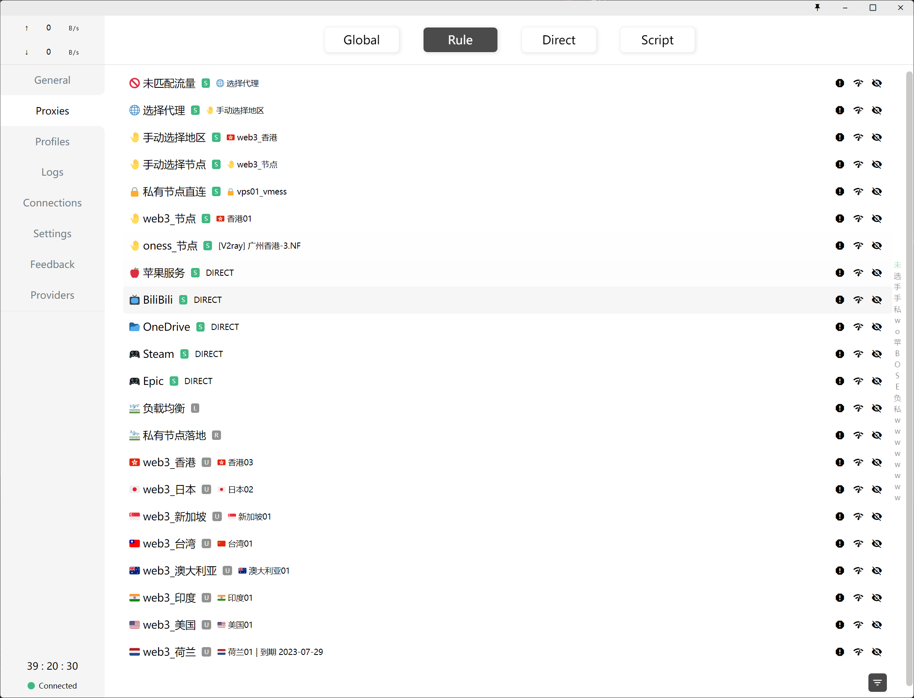

#### clash 配置文件合并

配置:
```json5
{
    //分组信息生成配置
    "GroupGenerateRules": [
        {
            "Name": "private",
            "GenCountryGroups": false
        },
        {
            "Name": "web3",
            "GenCountryGroups": true
        },
        {
            //匹配: VpnProviderConfigs[].name
            "Name": "oness",
            //按国家/地区生成分组, 分组类型为自动选择, 分组命名规则: {flag-emoji} {name}_{country}
            "GenCountryGroups": false
        }
    ],
    //自定义分组配置, 这里生成的分组会加上 `custom` 的 tag,  如果要将分组放到最后, OrderIndex 需要大于等于 100
    "CustomGroups": [
        {
            "Name": "🚫 未匹配流量",
            "Type": "select",
            "Filters": [
                "DIRECT", 
                "group::custom::选择代理"
            ]
        },
        {
            "Name": "🌐 选择代理",
            "Type": "select",
            "Filters": [
                "group::custom::私有节点直连", 
                "group::custom::私有节点落地",
                "group::custom::手动选择地区",
                "group::custom::手动选择节点"
            ]
        },
        {
            "Name": "🤚️ 手动选择地区",
            "Type": "select",
            "Filters": [
                "group::web3,area_group::.*",
            ]
        },
        {
            "Name": "🤚️ 手动选择节点",
            "Type": "select",
            "Filters": [
                "group::custom::web3_节点",
                "group::custom::oness_节点",
            ]
        },
        {
            "Name": "🔒 私有节点直连",
            "Type": "select",
            "Filters": [
                "proxy::private::vps01"
            ]
        },
        {
            "Name": "🤚️ web3_节点",
            "Type": "select",
            "Filters": [
                "proxy::web3::.*",
            ]
        },
        {
            "Name": "🤚️ oness_节点",
            "Type": "select",
            "Filters": [
                "proxy::oness::.*",
            ]
        },
        {
            "Name": "🍎 苹果服务",
            "Type": "select",
            "Filters": [
                "DIRECT",
                "group::custom::手动选择地区",
                "group::custom::手动选择节点",
                "group::custom::选择代理"
            ]
        },
        {
            "Name": "📺 BiliBili",
            "Type": "select",
            "Filters": [
                "DIRECT",
                //bilibili 番剧出差解禁
                "proxy::web3::香港|台湾" 
            ]
        },        
        {
            "Name": "📂 OneDrive",
            "Type": "select",
            "Filters": [
                "DIRECT",
                "group::custom::私有节点直连",                
                "group::custom::手动选择地区",
                "group::custom::选择代理"
            ]
        },        
        {
            "Name": "🎮 Steam",
            "Type": "select",
            "Filters": [
                "DIRECT",
                "group::custom::私有节点直连",                
                "group::custom::手动选择地区",
                "group::custom::选择代理"
            ]
        },        
        {
            "Name": "🎮 Epic",
            "Type": "select",
            "Filters": [
                "DIRECT",
                "group::custom::私有节点直连",                
                "group::custom::手动选择地区",
                "group::custom::选择代理"
            ]
        },
        {
            "Name": "🛫 负载均衡",
            "Type": "load-balance",
            //节点过滤, 多个filter按照顺序生成到 `proxies` 中, 格式: <proxies or groups>::<tag>::<正则>
            "Filters": [
                "proxy::oness::香港",
                "proxy::oness::日本"
            ]
        },
        {
            "Name": "🛬 私有节点落地",
            "Type": "relay",
            "Filters": [
                "group::custom::负载均衡",
                "proxy::private::vps02"
            ]
        }
    ],
    "RuleSets":[
        { "url": "https://ghproxy.com/https://raw.githubusercontent.com/ACL4SSR/ACL4SSR/master/Clash/Providers/Ruleset/Steam.yaml", "name": "steam", "behavior": "classical" },
        { "url": "https://ghproxy.com/https://raw.githubusercontent.com/ACL4SSR/ACL4SSR/master/Clash/Providers/Ruleset/Epic.yaml", "name": "epic", "behavior": "classical" },
        { "url": "https://ghproxy.com/https://raw.githubusercontent.com/ACL4SSR/ACL4SSR/master/Clash/Providers/Ruleset/OneDrive.yaml", "name": "onedrive", "behavior": "classical" },
        { "url": "https://ghproxy.com/https://raw.githubusercontent.com/Mythologyli/ZJU-Rule/master/Clash/Providers/Ruleset/Bilibili.yaml", "name": "bili", "behavior": "classical" },
        { "url": "https://ghproxy.com/https://raw.githubusercontent.com/Loyalsoldier/clash-rules/release/reject.txt", "name": "reject", "behavior": "domain" },
        { "url": "https://ghproxy.com/https://raw.githubusercontent.com/Loyalsoldier/clash-rules/release/icloud.txt", "name": "icloud", "behavior": "domain" },
        { "url": "https://ghproxy.com/https://raw.githubusercontent.com/Loyalsoldier/clash-rules/release/apple.txt", "name": "apple", "behavior": "domain" },
        { "url": "https://ghproxy.com/https://raw.githubusercontent.com/Loyalsoldier/clash-rules/release/google.txt", "name": "google", "behavior": "domain" },
        { "url": "https://ghproxy.com/https://raw.githubusercontent.com/Loyalsoldier/clash-rules/release/proxy.txt", "name": "proxy", "behavior": "domain" },
        { "url": "https://ghproxy.com/https://raw.githubusercontent.com/Loyalsoldier/clash-rules/release/direct.txt", "name": "direct", "behavior": "domain" },
        { "url": "https://ghproxy.com/https://raw.githubusercontent.com/Loyalsoldier/clash-rules/release/private.txt", "name": "private", "behavior": "domain" },
        { "url": "https://ghproxy.com/https://raw.githubusercontent.com/Loyalsoldier/clash-rules/release/gfw.txt", "name": "gfw", "behavior": "domain" },
        { "url": "https://ghproxy.com/https://raw.githubusercontent.com/Loyalsoldier/clash-rules/release/greatfire.txt", "name": "greatfire", "behavior": "domain" },
        { "url": "https://ghproxy.com/https://raw.githubusercontent.com/Loyalsoldier/clash-rules/release/tld-not-cn.txt", "name": "tld-not-cn", "behavior": "domain" },
        { "url": "https://ghproxy.com/https://raw.githubusercontent.com/Loyalsoldier/clash-rules/release/telegramcidr.txt", "name": "telegramcidr", "behavior": "ipcidr" },
        { "url": "https://ghproxy.com/https://raw.githubusercontent.com/Loyalsoldier/clash-rules/release/cncidr.txt", "name": "cncidr", "behavior": "ipcidr" },
        { "url": "https://ghproxy.com/https://raw.githubusercontent.com/Loyalsoldier/clash-rules/release/lancidr.txt", "name": "lancidr", "behavior": "ipcidr" }
    ],  
    "Rules":[
        "IP-CIDR,172.26.1.0/24,DIRECT",
        "IP-CIDR,172.26.2.0/24,DIRECT",
        "IP-CIDR,192.168.0.0/16,DIRECT",
        "IP-CIDR,200.1.3.0/24,DIRECT",
        "DOMAIN,clash.razord.top,选择代理",
        "DOMAIN,yacd.haishan.me,选择代理",
        "DOMAIN-SUFFIX,web3vpn.net,选择代理",
        "DOMAIN-SUFFIX,bing.com,选择代理",
        "DOMAIN-SUFFIX,bing.net,选择代理",
        "DOMAIN-SUFFIX,edge.microsoft.com,选择代理",
        "DOMAIN-SUFFIX,msftconnecttest.com,选择代理",
        "DOMAIN,bard.google.com,私有节点落地",
        "DOMAIN-SUFFIX,openai.com,日本",
        "RULE-SET,bili,BiliBili",
        "RULE-SET,icloud,苹果服务",
        "RULE-SET,apple,苹果服务",
        "RULE-SET,epic,Epic",
        "RULE-SET,steam,Steam",
        "RULE-SET,onedrive,OneDrive",
        "RULE-SET,proxy,选择代理",
        "RULE-SET,gfw,选择代理",
        "RULE-SET,tld-not-cn,选择代理",
        "RULE-SET,lancidr,DIRECT",
        "RULE-SET,private,DIRECT",
        "RULE-SET,google,选择代理",
        "GEOIP,CN,DIRECT",
        "MATCH,未匹配流量",
    ],
    "VpnProviders": [
        {
            //私有节点信息
            "Name": "private",
            "Url": "https://xx.vps.yaml"
        },
        {
            "Name": "web3",
            "Url": "https://xxx?target=clash"
        },
        {
            "Name": "oness",
            "Url": "https://xxx?clash=3",
            "ExcludeFilter": "公告"
        }
    ],
    //文件合并完成之后, 更新gist文件
    "GithubGist": {
        "Token":"token",
        "GistId":"gistid",
        "FileName":"filename",
    }
}
```

生成配置:
